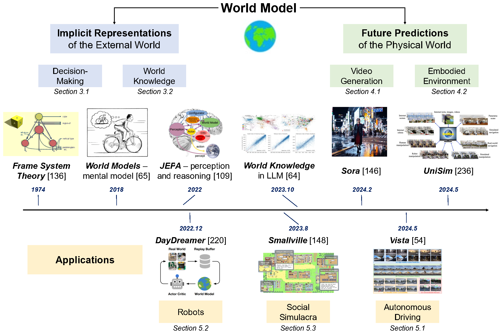

# Awesome-World-Model [](https://github.com/sindresorhus/awesome)

A curated list of awesome resources on World Models, based on the comprehensive survey "Understanding World or Predicting Future? A Comprehensive Survey of World Models".



## News🔥

* **[2024/11/21]** Initial release of our survey is available on [arXiv](https://arxiv.org/abs/2411.14499v1).
* **[2025/06/13]** Our survey paper "Understanding World or Predicting Future? A Comprehensive Survey of World Models" has been accepted by [ACM Computing Surveys](https://dl.acm.org/doi/abs/10.1145/3746449).
* **[2025/06/25]** Second version of our survey is available on [arXiv](https://arxiv.org/abs/2411.14499).
* **[2025/07/18]** Initial release of the Awesome-World-Model GitHub repository.

## Contact
If you have any suggestions or find our work helpful, feel free to contact us  
Email: dingjt15@tsinghua.org.cn

If this list helps your research, please ⭐ and cite:

```bibtex
@article{ding2025worldmodels,
  title={Understanding World or Predicting Future? A Comprehensive Survey of World Models},
  author={Ding, Jingtao and Zhang, Yunke and Shang, Yu and Zhang, Yuheng and Zong, Zefang and Feng, Jie and Yuan, Yuan and Su, Hongyu and Li, Nian and Sukiennik, Nicholas and Xu, Fengli and Li, Yong},
  journal={ACM Computing Surveys},
  year={2025}
}
```

## Table of Contents 🍃

* [1 Introduction & 2 Background](#1-introduction--2-background)
* [3 Implicit Representation of the External World](#3-implicit-representation-of-the-external-world)
    * [3.1 World Model in Decision Making](#31-world-model-decision-making)
    * [3.2 World Knowledge Learned by Models](#32-world-knowledge-learned)
* [4 Future Prediction of the Physical World](#4-future-predictions-of-the-external-world)
    * [4.1 World Model as Video Generation](#41-what-to-predict)
    * [4.2 World Model as Embodied Environment](#42-how-to-predict)
* [5 Applications of World Models](#5-applications-of-world-models)
    * [5.1 Autonomous Driving](#51-world-models-for-decision-making-and-control)
    * [5.2 Robots](#52-world-models-for-generative-tasks)
    * [5.3 Social Simulacra](#53-world-models-for-embodied-intelligence)


## 1 Introduction & 2 Background

| Title | Pub. & Date | Code/Project URL |
|---|---|---|
| [Sora: Creating video from text](https://openai.com/sora) | OpenAI 2024 | |
| [A path towards autonomous machine intelligence version 0.9.2, 2022-06-27](https://openreview.net/forum?id=BZ5a1r-kVsf) | Open Review 2022 | |
| [A framework for representing knowledge](https://dspace.mit.edu/handle/1721.1/5834) | 1974 | |
| [Recurrent world models facilitate policy evolution](https://proceedings.neurips.cc/paper/2018/file/2de5d16682c3c35007e4e92982f1a2ba-Paper.pdf) | 2018 | [](https://worldmodels.github.io/) |
| [World models](https://arxiv.org/abs/1803.10122) | 2018 | [](https://worldmodels.github.io/) |
| [Mental models: Towards a cognitive science of language, inference, and consciousness](https://www.hup.harvard.edu/books/9780674568512) | | |
| [Sora as an agi world model? a complete survey on text-to-video generation](https://arxiv.org/abs/2403.05131) | arXiv 2024 | |
| [Is sora a world simulator? a comprehensive survey on general world models and beyond](https://arxiv.org/abs/2405.03520) | arXiv 2024 | |
| [World models for autonomous driving: An initial survey](https://arxiv.org/abs/2401.01312) | IEEE T-IV 2024 | |
| [Data-centric evolution in autonomous driving: A comprehensive survey of big data system, data mining, and closed-loop technologies](https://arxiv.org/abs/2401.12888) | arXiv 2024 | |
| [Forging vision foundation models for autonomous driving: Challenges, methodologies, and opportunities](https://arxiv.org/abs/2401.08045) | arXiv 2024 | |
| [From Efficient Multimodal Models to World Models: A Survey](https://arxiv.org/abs/2407.00118) | arXiv 2024 | |
| [MultiNet: Real-time Joint Semantic Reasoning for Autonomous Driving](https://ieeexplore.ieee.org/document/8569113) | arXiv 2018 | |
| [YOLOP: You Only Look Once for Panoptic Driving Perception](https://link.springer.com/article/10.1007/s11633-022-1339-y) | Image and Vision Computing 2022 | [](https://github.com/hustvl/YOLOP) |
| [Scene transformer: A unified multi-task model for behavior prediction and planning](https://openreview.net/forum?id=53A9Pu06k63) | | |
| [Motion transformer with global intention localization and local movement refinement](https://proceedings.neurips.cc/paper_files/paper/2022/file/2c89109d44ed535a8f05c15b25357c18-Paper-Conference.pdf) | NeurIPS 2022 | [](https://github.com/sshaoshuai/MTR) |
| [Query-centric trajectory prediction](https://openaccess.thecvf.com/content/CVPR2023/papers/Zhou_Query-Centric_Trajectory_Prediction_CVPR_2023_paper.pdf) | CVPR 2023 | |
| [Gnm: A general navigation model to drive any robot](https://ieeexplore.ieee.org/document/10160295) | IEEE Trans. on Robotics 2023 | [](https://general-navigation-models.github.io/) |
| [Repvit: Revisiting mobile cnn from vit perspective](https://openaccess.thecvf.com/content/CVPR2024/papers/Wang_RepViT_Revisiting_Mobile_CNN_From_ViT_Perspective_CVPR_2024_paper.pdf) | CVPR 2024 | [](https://github.com/THU-MIG/RepViT) |
| [Learning latent dynamics for planning from pixels](https://proceedings.mlr.press/v97/hafner19a/hafner19a.pdf) | ICML 2019 | [](https://danijar.com/project/planet) |
| [S3: Social-network Simulation System with Large Language Model-Empowered Agents](https://arxiv.org/abs/2307.14984) | arXiv 2023 | |
| [Generative agents: Interactive simulacra of human behavior](https://dl.acm.org/doi/10.1145/3586183.3606763) | UIST 2023 | [](https://github.com/joonspk-research/generative_agents) |

## 3 Implicit Representation of the External World

### 3.1 World Model in Decision Making

| Title | Pub. & Date | Code/Project URL |
|---|---|---|
| [Deep reinforcement learning in a handful of trials using probabilistic dynamics models](https://proceedings.neurips.cc/paper/2018/file/006f52e9102a8d3be2fe5614f42ba989-Paper.pdf) | NeurIPS 2018 | [](https://github.com/kchua/handful-of-trials) |
| [PWM: Policy Learning with Multi-Task World Models](https://openreview.net/pdf?id=KKN4OFyzvN) | OpenReview | [](https://imgeorgiev.com/pwm) |
| [Recurrent world models facilitate policy evolution](https://proceedings.neurips.cc/paper/2018/file/2de5d16682c3c35007e4e92982f1a2ba-Paper.pdf) | NeurIPS 2018 | [](https://worldmodels.github.io/) |
| [Dream to control: Learning behaviors by latent imagination](https://arxiv.org/abs/1912.01603) | arXiv 2019 | [](https://danijar.com/project/dreamer) |
| [Leveraging pre-trained large language models to construct and utilize world models for model-based task planning](https://proceedings.neurips.cc/paper_files/paper/2023/file/a7f14143a825f3e0c036c641829e0839-Paper-Conference.pdf) | NeurIPS 2023 | [](https://github.com/GuanSuns/LLMs-World-Models-for-Planning) |
| [Mastering atari with discrete world models](https://arxiv.org/abs/2010.02193) | arXiv 2020 | [](https://danijar.com/project/dreamerv2) |
| [Mastering diverse control tasks through world models](https://www.nature.com/articles/s41586-024-07871-x) | Nature 2024 | [](https://danijar.com/project/dreamerv3) |
| [TD-MPC2: Scalable, Robust World Models for Continuous Control](https://openreview.net/forum?id=Oxh5CstDJU) | OpenReview | [](https://nicklashansen.github.io/td-mpc2) |
| [When to trust your model: Model-based policy optimization](https://proceedings.neurips.cc/paper/2019/file/258be2de6eb6952aa35065474166379a-Paper.pdf) | NeurIPS 2019 | |
| [Offline reinforcement learning as one big sequence modeling problem](https://proceedings.neurips.cc/paper/2021/file/099fe6b0b444c23836c4a5d07346082b-Paper.pdf) | NeurIPS 2021 | [](https://github.com/jannerm/trajectory-transformer) |
| [Model predictive control](https://link.springer.com/book/10.1007/978-3-319-22592-7) | Springer | |
| [Algorithmic framework for model-based deep reinforcement learning with theoretical guarantees](https://arxiv.org/abs/1807.03858) | arXiv 2018 | |
| [Neural network dynamics for model-based deep reinforcement learning with model-free fine-tuning](https://ieeexplore.ieee.org/document/8460505) | IEEE 2018 | |
| [A game theoretic framework for model based reinforcement learning](https://proceedings.mlr.press/v119/rajeswaran20a.html) | PMLR 2020 | [](https://sites.google.com/view/mbrl-game) |
| [General agents need world models](https://arxiv.org/abs/2506.01622) | arXiv 2025 | |
| [Mastering memory tasks with world models](https://arxiv.org/abs/2403.04253) | arXiv 2024 | |
| [A generalist dynamics model for control](https://arxiv.org/abs/2305.10912) | arXiv 2023 | |
| [Exploring model-based planning with policy networks](https://arxiv.org/abs/1906.08649) | arXiv 2019 | |
| [Derivative-free optimization via classification](https://ojs.aaai.org/index.php/AAAI/article/view/10255) | AAAI | |
| [Mastering the game of Go with deep neural networks and tree search](https://www.nature.com/articles/nature16961) | Nature 2016 | |
| [Mastering the game of go without human knowledge](https://www.nature.com/articles/nature24270) | Nature 2017 | |
| [A0c: Alpha zero in continuous action space](https://arxiv.org/abs/1805.09613) | arXiv 2018 | |
| [Value prediction network](https://proceedings.neurips.cc/paper/2017/file/d045c59a90d7587d8d671b5f5aec4e7c-Paper.pdf) | NeurIPS 2017 | |
| [Probabilistic adaptation of text-to-video models](https://arxiv.org/abs/2306.01872) | arXiv 2023 | [](https://prob-t2v.github.io/) |
| [RoboDreamer: Learning Compositional World Models for Robot Imagination](https://arxiv.org/abs/2404.12377) | arXiv 2024 | [](https://robodreamer.github.io/) |
| [Discuss before moving: Visual language navigation via multi-expert discussions](https://ieeexplore.ieee.org/document/10565013) | IEEE 2024 | [](https://sites.google.com/view/discussnav) |
| [OVER-NAV: Elevating Iterative Vision-and-Language Navigation with Open-Vocabulary Detection and Structured Representation](https://openaccess.thecvf.com/content/CVPR2024/papers/Zhao_OVER-NAV_Elevating_Iterative_Vision-and-Language_Navigation_With_Open-Vocabulary_Detection_and_CVPR_2024_paper.pdf) | CVPR 2024 | [](https://github.com/GAN-Z/OVER-NAV) |
| [RILA: Reflective and Imaginative Language Agent for Zero-Shot Semantic Audio-Visual Navigation](https://openaccess.thecvf.com/content/CVPR2024/papers/Yang_RILA_Reflective_and_Imaginative_Language_Agent_for_Zero-Shot_Semantic_CVPR_2024_paper.pdf) | CVPR 2024 | [](https://rila-agent.github.io/) |
| [Towards Large Reasoning Models: A Survey of Reinforced Reasoning with Large Language Models](https://arxiv.org/abs/2501.09686) | arXiv 2025 | |
| [Position: LLMs can't plan, but can help planning in LLM-modulo frameworks](https://arxiv.org/abs/2402.01817) | arXiv 2024 | |
| [Language models meet world models: Embodied experiences enhance language models](https://proceedings.neurips.cc/paper_files/paper/2023/file/206f20295c520334237c15815653b216-Paper-Conference.pdf) | NeurIPS 2023 | [](https://github.com/E2WM/E2WM-NeurIPS23) |
| [Virtualhome: Simulating household activities via programs](https://openaccess.thecvf.com/content_cvpr_2018/papers/Puig_VirtualHome_Simulating_Household_CVPR_2018_paper.pdf) | CVPR 2018 | [](http://virtual-home.org/) |
| [Learning to Model the World with Language](https://arxiv.org/abs/2308.01399) | arXiv 2023 | [](https://dynalang.github.io/) |
| [Reason for Future, Act for Now: A Principled Framework for Autonomous LLM Agents with Provable Sample Efficiency](https://arxiv.org/abs/2309.17382) | arXiv 2023 | |
| [Alfworld: Aligning text and embodied environments for interactive learning](https://openreview.net/forum?id=0IO2UCN-kDb) | OpenReview | [](https://github.com/alfworld/alfworld) |

### 3.2 World Knowledge Learned by Models

| Title | Pub. & Date | Code / Project URL |
|---|---|---|
| [Language Models Represent Space and Time](https://openreview.net/forum?id=vTf65j92F5) | ICLR 2024 | — |
| [The Geometry of Concepts: Sparse Autoencoder Feature Structure](https://arxiv.org/abs/2410.19750) | arXiv 2024 | — |
| [GeoLLM: Extracting Geospatial Knowledge from Large Language Models](https://arxiv.org/abs/2310.06213) | arXiv 2023 | [GitHub](https://rohinmanvi.github.io/GeoLLM/) |
| [Large language models are geographically biased](https://arxiv.org/abs/2402.02680) | arXiv 2024 | — |
| [CityGPT: Empowering Urban Spatial Cognition of Large Language Models](https://arxiv.org/abs/2406.13948) | arXiv 2024 | [GitHub](https://github.com/tsinghua-fib-lab/CityGPT) |
| [GPT4GEO: How a Language Model Sees the World’s Geography](https://arxiv.org/abs/2306.00020) | NeurIPS 2023 | — |
| [CityBench: Evaluating the Capabilities of Large Language Model as World Model](https://arxiv.org/abs/2406.13945) | arXiv 2024 | [GitHub](https://github.com/tsinghua-fib-lab/CityGPT) |
| [A Survey of Large Language Model-Powered Spatial Intelligence Across Scales](https://arxiv.org/abs/2504.09848) | arXiv 2025 | — |
| [Automated construction of cognitive maps with visual predictive coding](https://www.nature.com/articles/s42256-024-00863-7) | Nature Machine Intelligence 2024 | — |
| [Emergent Representations of Program Semantics in Language Models Trained on Programs](https://proceedings.mlr.press/v235/jin24a.html) | ICML 2024 | — |
| [Does the chimpanzee have a theory of mind?](https://www.cambridge.org/core/journals/behavioral-and-brain-sciences/article/abs/does-the-chimpanzee-have-a-theory-of-mind) | Behav. & Brain Sci. 1978 | — |
| [Elements of World Knowledge (EWOK)](https://arxiv.org/abs/2405.09605) | arXiv 2024 | — |
| [Testing theory of mind in large language models and humans](https://www.nature.com/articles/s41562-024-01962-z) | Nature Human Behaviour 2024 | — |
| [LLMs achieve adult human performance on higher-order theory of mind tasks](https://arxiv.org/abs/2405.18870) | arXiv 2024 | — |
| [COKE: A cognitive knowledge graph for machine theory of mind](https://aclanthology.org/2023.findings-acl.30/) | ACL 2023 | — |
| [Think Twice: Perspective-Taking Improves LLM Theory-of-Mind](https://arxiv.org/abs/2311.10227) | arXiv 2023 | — |

## 4 Future Prediction of the Physical World

### 4.1 World Model as Video Generation

| Title                                                                                                                    | Pub. & Date      | Code / Project URL                                                            |
| ------------------------------------------------------------------------------------------------------------------------ | ---------------- | ----------------------------------------------------------------------------- |
| [Video generation models as world simulators](https://openai.com/research/video-generation-models-as-world-simulators)   | OpenAI Blog 2024 | —                                                                             |
| [Sora: Creating video from text](https://openai.com/sora)                                                                | OpenAI 2024      | —                                                                             |
| [Is Sora a world simulator? A comprehensive survey on general world models and beyond](https://arxiv.org/abs/2405.03520) | arXiv 2024       | —                                                                             |
| [Sora as an AGI world model? A complete survey on text-to-video generation](https://arxiv.org/abs/2403.05131)            | arXiv 2024       | —                                                                             |
| [How Far is Video Generation from World Model: A Physical Law Perspective](https://arxiv.org/abs/2411.02385)             | arXiv 2024       | —                                                                             |
| [Do generative video models learn physical principles from watching videos?](https://arxiv.org/abs/2501.09038)           | arXiv 2025       | [Website](https://physics-iq.github.io/)                                      |
| [Genesis: A Generative and Universal Physics Engine for Robotics and Beyond](https://arxiv.org/abs/2405.18556)           | arXiv 2024       | [GitHub](https://github.com/Genesis-Embodied-AI/Genesis)                      |
| [PhysGen: Rigid-body physics-grounded image-to-video generation](https://arxiv.org/abs/2403.11219)                       | ECCV 2024        | [Website](https://physgen.github.io/)                                         |
| [NUWA-XL: Diffusion over Diffusion for Extremely Long Video Generation](https://arxiv.org/abs/2303.12346)                | arXiv 2023       | —                                                                             |
| [Learning a 3D occupancy world model for autonomous driving](https://arxiv.org/abs/2311.16038)                           | arXiv 2023       | [Website](https://wenzhaozheng.com/occworld/)                                 |
| [OccSora: 4D Occupancy Generation Models as World Simulators](https://arxiv.org/abs/2405.20337)                          | arXiv 2024       | [Website](https://leningwang.github.io/occsora/)                              |
| [World model on million-length video and language with ring-attention](https://arxiv.org/abs/2402.08268)                 | arXiv 2024       | [Website](https://large-world-model.github.io/)                               |
| [GAIA-1: A generative world model for autonomous driving](https://arxiv.org/abs/2309.17080)                              | arXiv 2023       | [Website](https://wayve.com/thinking/gaia-1-generative-ai-model-for-driving/) |
| [DriveDreamer: Towards real-world-driven world models](https://arxiv.org/abs/2309.09777)                                 | arXiv 2023       | [GitHub](https://github.com/Tsinghua-MARS-Lab/DriveDreamer)                   |
| [DriveDreamer-2: LLM-Enhanced World Models for Diverse Driving Video Generation](https://arxiv.org/abs/2403.06845)       | arXiv 2024       | [GitHub](https://github.com/Tsinghua-MARS-Lab/DriveDreamer)                   |
| [Driving into the Future: Multiview Visual Forecasting and Planning with World Model](https://arxiv.org/abs/2311.17918)  | arXiv 2023       | [GitHub](https://github.com/OpenDriveLab/Drive-WM)                            |
| [Vista: A Generalizable Driving World Model with High Fidelity](https://arxiv.org/abs/2405.17398)                        | arXiv 2024       | —                                                                             |
| [WorldDreamer: Towards general world models for video generation](https://arxiv.org/abs/2401.09985)                      | arXiv 2024       | [Website](https://world-dreamer.github.io/)                                   |
| [WorldGPT: a Sora-inspired video AI agent](https://arxiv.org/abs/2403.07944)                                             | arXiv 2024       | —                                                                             |


### 4.2 World Model as Embodied Environment

| Title | Pub. & Date | Code / Project URL |
|---|---|---|
| [Ai2-thor: An interactive 3d environment for visual ai](http://ai2thor.allenai.org) | arXiv 2017 | [GitHub](http://ai2thor.allenai.org) |
| [Matterport3D: Learning from RGB-D Data in Indoor Environments](https://arxiv.org/abs/1709.06158) | arXiv 2017 | [GitHub](https://niessner.github.io/Matterport/) |
| [Virtualhome: Simulating household activities via programs](https://openaccess.thecvf.com/content_cvpr_2018/papers/Puig_VirtualHome_Simulating_Household_CVPR_2018_paper.pdf) | CVPR 2018 | [GitHub](http://virtual-home.org/) |
| [Habitat: A platform for embodied ai research](https://openaccess.thecvf.com/content_ICCV_2019/papers/Savva_Habitat_A_Platform_for_Embodied_AI_Research_ICCV_2019_paper.pdf) | ICCV 2019 | [GitHub](https://aihabitat.org/) |
| [Avlen: Audio-visual-language embodied navigation in 3d environments](https://proceedings.neurips.cc/paper_files/paper/2022/file/28f699175783a2c828ae74d53dd3da20-Paper-Conference.pdf) | NeurIPS 2022 | [GitHub](https://www.google.com/search?q=https://github.com/sudiptapaul/AVLEN) |
| [ProcTHOR: Large-Scale Embodied AI Using Procedural Generation](https://proceedings.neurips.cc/paper_files/paper/2022/file/27c546ab1e4f1d7d638e6a8dfbad9a07-Paper-Conference.pdf) | NeurIPS 2022 | [GitHub](https://procthor.allenai.org/) |
| [Anyhome: Open-vocabulary generation of structured and textured 3d homes](https://arxiv.org/abs/2312.06644) | arXiv 2023 | [GitHub](https://www.google.com/search?q=https://anyhome.github.io/) |
| [LEGENT: Open Platform for Embodied Agents](https://arxiv.org/abs/2404.18243) | arXiv 2024 | [GitHub](https://github.com/thunlp/LEGENT) |
| [Threedworld: A platform for interactive multi-modal physical simulation](https://arxiv.org/abs/2007.04954) | arXiv 2020 | [GitHub](https://github.com/threedworld-mit/tdw) |
| [Minedojo: Building open-ended embodied agents with internet-scale knowledge](https://arxiv.org/abs/2206.08853) | arXiv 2022 | [GitHub](https://github.com/MineDojo/MineDojo) |
| [EmbodiedCity: A Benchmark Platform for Embodied Agent in Real-world City Environment](https://arxiv.org/abs/2410.09604) | arXiv 2024 | [GitHub](https://www.google.com/search?q=https://embodied-city.github.io/) |
| [EVA: An Embodied World Model for Future Video Anticipation](https://arxiv.org/abs/2410.15461) | arXiv 2024 | [GitHub](https://sites.google.com/view/eva-public) |
| [Streetscapes: Large-scale consistent street view generation using autoregressive video diffusion](https://arxiv.org/abs/2406.03578) | arXiv 2024 | [GitHub](https://boyangdeng.com/streetscapes/) |
| [AVID: Adapting Video Diffusion Models to World Models](https://arxiv.org/abs/2410.12822) | arXiv 2024 | [GitHub](https://www.google.com/search?q=https://marcrigter.github.io/AVID/) |
| [Recurrent world models facilitate policy evolution](https://proceedings.neurips.cc/paper/2018/file/2de5d16682c3c35007e4e92982f1a2ba-Paper.pdf) | NeurIPS 2018 | [GitHub](https://worldmodels.github.io/) |

## 5 Applications of World Models

### 5.1 Autonomous Driving

| Title | Pub. & Date | Code / Project URL |
|---|---|---|
| [Video generation models as world simulators](https://openai.com/research/video-generation-models-as-world-simulators) | OpenAI Research (2024) | [website](https://openai.com/research/video-generation-models-as-world-simulators) |
| [GPT-4 technical report](https://arxiv.org/abs/2303.08774) | arXiv 2023 | [website](https://arxiv.org/abs/2303.08774) |
| [Visual Instruction Tuning](https://arxiv.org/abs/2304.08485) | arXiv 2023 | [website](https://llava-vl.github.io) |
| [World models for autonomous driving: An initial survey](https://arxiv.org/abs/2401.01312) | IEEE T-IV 2024 | [website](https://arxiv.org/abs/2401.01312) |
| [Waymax: An accelerated, data-driven simulator for large-scale autonomous driving research](https://arxiv.org/abs/2310.17918) | arXiv 2023 | [GitHub](https://github.com/waymo-research/waymax) |
| [Model-free deep reinforcement learning for urban autonomous driving](https://arxiv.org/abs/1904.09503) | arXiv 2019 | [website](https://arxiv.org/abs/1904.09503) |
| [Planning-oriented autonomous driving](https://arxiv.org/abs/2212.10156) | arXiv 2022 | [GitHub](https://github.com/OpenDriveLab/UniAD) |
| [A survey on trajectory-prediction methods for autonomous driving](https://ieeexplore.ieee.org/document/9779556) | IEEE T-IV 2022 | [website](https://ieeexplore.ieee.org/document/9779556) |
| [BEVFormer: Learning bird’s-eye-view representation from multi-camera images via spatiotemporal transformers](https://arxiv.org/abs/2203.17270) | arXiv 2022 | [GitHub](https://github.com/fundamentalvision/BEVFormer) |
| [Transfusion: Robust lidar-camera fusion for 3D object detection with transformers](https://openaccess.thecvf.com/content/CVPR2022/papers/Bai_TransFusion_Robust_LiDAR-Camera_Fusion_for_3D_Object_Detection_With_Transformers_CVPR_2022_paper.pdf) | CVPR 2022 | [GitHub](https://github.com/XuyangBai/TransFusion) |
| [OmniDet: Surround-view cameras based multi-task visual perception network for autonomous driving](https://arxiv.org/abs/2102.07448) | arXiv 2021 | [website](https://arxiv.org/abs/2102.07448) |
| [YOLOP: You only look once for panoptic driving perception](https://link.springer.com/article/10.1007/s11633-022-1339-y) | MIR 2022 | [GitHub](https://github.com/hustvl/YOLOP) |
| [Wayformer: Motion forecasting via simple & efficient attention networks](https://arxiv.org/abs/2207.05844) | arXiv 2022 | [website](https://arxiv.org/abs/2207.05844) |
| [MTR: Motion transformer with global intention localization and local movement refinement](https://proceedings.neurips.cc/paper_files/paper/2022/file/2c89109d44ed535a8f05c15b25357c18-Paper-Conference.pdf) | NeurIPS 2022 | [GitHub](https://github.com/sshaoshuai/MTR) |
| [QCNet: Query-centric trajectory prediction](https://openaccess.thecvf.com/content/CVPR2023/papers/Zhou_Query-Centric_Trajectory_Prediction_CVPR_2023_paper.pdf) | CVPR 2023 | [website](https://openaccess.thecvf.com/content/CVPR2023/papers/Zhou_Query-Centric_Trajectory_Prediction_CVPR_2023_paper.pdf) |
| [HPTR: Real-time motion prediction via heterogeneous polyline transformer with relative pose encoding](https://arxiv.org/abs/2310.12970) | arXiv 2023 | [website](https://arxiv.org/abs/2310.12970) |
| [MotionDiffuser: Controllable multi-agent motion prediction using diffusion](https://openaccess.thecvf.com/content/CVPR2023/papers/Jiang_MotionDiffuser_Controllable_Multi-Agent_Motion_Prediction_Using_Diffusion_CVPR_2023_paper.pdf) | CVPR 2023 | [website](https://openaccess.thecvf.com/content/CVPR2023/papers/Jiang_MotionDiffuser_Controllable_Multi-Agent_Motion_Prediction_Using_Diffusion_CVPR_2023_paper.pdf) |
| [Tokenize the world into object-level knowledge to address long-tail events in autonomous driving](https://arxiv.org/abs/2407.00959) | arXiv 2024 | [website](https://arxiv.org/abs/2407.00959) |
| [OmniDrive: A generalist driving model for perception and planning](https://arxiv.org/abs/2406.09500) | arXiv 2024 | [website](https://arxiv.org/abs/2406.09500) |
| [GAIA-1: A generative world model for autonomous driving](https://arxiv.org/abs/2309.17080) | arXiv 2023 | [website](https://wayve.com/thinking/gaia-1-generative-ai-model-for-driving) |
| [DriveDreamer: Towards real-world-driven world models for autonomous driving](https://arxiv.org/abs/2309.09777) | arXiv 2023 | [GitHub](https://github.com/Tsinghua-MARS-Lab/DriveDreamer) |
| [Drive-WM: Multiview visual forecasting and planning with world model for autonomous driving](https://arxiv.org/abs/2311.17918) | arXiv 2023 | [GitHub](https://github.com/OpenDriveLab/Drive-WM) |
| [OccWorld: Learning a 3D occupancy world model for autonomous driving](https://arxiv.org/abs/2311.16038) | arXiv 2023 | [website](https://wenzhaozheng.com/occworld) |
| [OccSora: 4D occupancy generation models as world simulators for autonomous driving](https://arxiv.org/abs/2405.20337) | arXiv 2024 | [website](https://leningwang.github.io/occsora) |
| [Vista: A generalizable driving world model with high fidelity and versatile controllability](https://arxiv.org/abs/2405.17398) | arXiv 2024 | [website](https://arxiv.org/abs/2405.17398) |
| [Copilot4D: Learning unsupervised world models for autonomous driving via discrete diffusion](https://arxiv.org/abs/2311.01017) | arXiv 2023 | [website](https://copilot4d.github.io) |
| [MUVO: A multimodal generative world model for autonomous driving with geometric representations](https://arxiv.org/abs/2311.11762) | arXiv 2023 | [GitHub](https://github.com/fzi-forschungszentrum-informatik/muvo) |
| [UniWorld: Autonomous driving pre-training via world models](https://arxiv.org/abs/2308.07234) | arXiv 2023 | [website](https://arxiv.org/abs/2308.07234) |
| [MetaUrban: A simulation platform for embodied AI in urban spaces](https://arxiv.org/abs/2407.08725) | arXiv 2024 | [GitHub](https://github.com/metadriverse/MetaUrban) |
| [UrbanWorld: An urban world model for 3D city generation](https://arxiv.org/abs/2407.11965) | arXiv 2024 | [website](https://urban-world-model.github.io) |
| [Streetscapes: Large-scale consistent street view generation using autoregressive video diffusion](https://arxiv.org/abs/2406.03578) | arXiv 2024 | [website](https://boyangdeng.com/streetscapes) |
| [Recurrent world models facilitate policy evolution](https://proceedings.neurips.cc/paper/2018/file/2de5d16682c3c35007e4e92982f1a2ba-Paper.pdf) | NeurIPS 2018 | [website](https://worldmodels.github.io) |

### 5.2 Robots

| Title                                                                                                                                                                                                                          | Pub. & Date                      | Code / Project URL                                                                                                      |
| ------------------------------------------------------------------------------------------------------------------------------------------------------------------------------------------------------------------------------ | -------------------------------- | ----------------------------------------------------------------------------------------------------------------------- |
| [Denoising diffusion probabilistic models](https://proceedings.neurips.cc/paper/2020/file/4c5bcfec8584af0d967f1ab10179ca4b-Paper.pdf)                                                                                          | NeurIPS 2020                     | [GitHub](https://github.com/hojonathanho/diffusion)                                                                     |
| [Attention is all you need](https://proceedings.neurips.cc/paper/2017/file/3f5ee243547dee91fbd053c1c4a845aa-Paper.pdf)                                                                                                         | NeurIPS 2017                     | [website](https://proceedings.neurips.cc/paper/2017/file/3f5ee243547dee91fbd053c1c4a845aa-Paper.pdf)                    |
| [Direct preference optimization: Your language model is secretly a reward model](https://arxiv.org/abs/2305.18290)                                                                                                             | arXiv 2023                       | [GitHub](https://github.com/eric-mitchell/direct-preference-optimization)                                               |
| [Proximal policy optimization algorithms](https://arxiv.org/abs/1707.06347)                                                                                                                                                    | arXiv 2017                       | [website](https://arxiv.org/abs/1707.06347)                                                                             |
| [Unsupervised learning for physical interaction through video prediction](https://proceedings.neurips.cc/paper/2016/file/04025959b191f819de415500f427f2db-Paper.pdf)                                                           | NeurIPS 2016                     | [website](https://sites.google.com/site/videoprediction)                                                                |
| [Deep visual foresight for planning robot motion](https://arxiv.org/abs/1610.00696)                                                                                                                                            | arXiv 2017                       | [website](https://sites.google.com/site/deepvisualforesight)                                                            |
| [Simultaneous localization and mapping: part I](https://ieeexplore.ieee.org/document/1641410)                                                                                                                                  | IEEE 2006                        | [website](https://ieeexplore.ieee.org/document/1641410)                                                                 |
| [A survey on learning-based robotic grasping](https://link.springer.com/article/10.1007/s43154-020-00023-5)                                                                                                                    | Current Robotics Reports 2020    | [website](https://link.springer.com/article/10.1007/s43154-020-00023-5)                                                 |
| [Uncertainty-aware reinforcement learning for collision avoidance](https://arxiv.org/abs/1702.01182)                                                                                                                           | arXiv 2017                       | [website](https://sites.google.com/view/uncertainty-aware-rl)                                                           |
| [Human-level control through deep reinforcement learning](https://www.nature.com/articles/nature14236)                                                                                                                         | Nature 2015                      | [website](https://www.nature.com/articles/nature14236)                                                                  |
| [Rich feature hierarchies for accurate object detection and semantic segmentation](https://openaccess.thecvf.com/content_cvpr_2014/papers/Girshick_Rich_Feature_Hierarchies_2014_CVPR_paper.pdf)                               | CVPR 2014                        | [website](https://openaccess.thecvf.com/content_cvpr_2014/papers/Girshick_Rich_Feature_Hierarchies_2014_CVPR_paper.pdf) |
| [ImageNet classification with deep convolutional neural networks](https://proceedings.neurips.cc/paper/2012/file/c399862d3b9d6b76c8436e924a68c45b-Paper.pdf)                                                                   | NeurIPS 2012                     | [website](https://proceedings.neurips.cc/paper/2012/file/c399862d3b9d6b76c8436e924a68c45b-Paper.pdf)                    |
| [Gradient-based learning applied to document recognition](https://ieeexplore.ieee.org/document/726791)                                                                                                                         | Proc. IEEE 1998                  | [website](https://ieeexplore.ieee.org/document/726791)                                                                  |
| [An image is worth 16x16 words: Transformers for image recognition at scale](https://arxiv.org/abs/2010.11929)                                                                                                                 | arXiv 2020                       | [GitHub](https://github.com/google-research/vision_transformer)                                                         |
| [RepViT: Revisiting mobile CNN from ViT perspective](https://openaccess.thecvf.com/content/CVPR2024/papers/Wang_RepViT_Revisiting_Mobile_CNN_From_ViT_Perspective_CVPR_2024_paper.pdf)                                         | CVPR 2024                        | [GitHub](https://github.com/THU-MIG/RepViT)                                                                             |
| [RoboCraft: Learning to see, simulate, and shape elasto-plastic objects in 3D with graph networks](https://journals.sagepub.com/doi/10.1177/02783649231224167)                                                                 | IJRR 2024                        | [website](https://robocraft-3d.github.io)                                                                               |
| [PointNet: Deep learning on point sets for 3D classification and segmentation](https://openaccess.thecvf.com/content_cvpr_2017/papers/Qi_PointNet_Deep_Learning_CVPR_2017_paper.pdf)                                           | CVPR 2017                        | [GitHub](https://github.com/charlesq34/pointnet)                                                                        |
| [PointNeXt: Revisiting PointNet++ with improved training and scaling strategies](https://proceedings.neurips.cc/paper_files/paper/2022/file/a08da34aa3c8351b17c317088a82f32a-Paper-Conference.pdf)                             | NeurIPS 2022                     | [GitHub](https://github.com/guochengqian/PointNeXt)                                                                     |
| [Automated construction of cognitive maps with visual predictive coding](https://www.nature.com/articles/s42256-024-00863-7)                                                                                                   | Nature Machine Intelligence 2024 | [website](https://www.nature.com/articles/s42256-024-00863-7)                                                           |
| [SpatialLM: Large Language Model for Spatial Understanding](https://arxiv.org/abs/2407.13063)                                                                                                                                  | arXiv 2024                       | [GitHub](https://github.com/manycore-research/SpatialLM)                                                                |
| [Language models are few-shot learners](https://proceedings.neurips.cc/paper/2020/file/1457c0d6bfcb4967418bfb8ac142f64a-Paper.pdf)                                                                                             | NeurIPS 2020                     | [website](https://proceedings.neurips.cc/paper/2020/file/1457c0d6bfcb4967418bfb8ac142f64a-Paper.pdf)                    |
| [Glam: Efficient scaling of language models with mixture-of-experts](https://proceedings.mlr.press/v162/du22c.html)                                                                                                            | ICML 2022                        | [website](https://proceedings.mlr.press/v162/du22c.html)                                                                |
| [Llama: Open and efficient foundation language models](https://arxiv.org/abs/2302.13971)                                                                                                                                       | arXiv 2023                       | [GitHub](https://github.com/facebookresearch/llama)                                                                     |
| [NL2Plan: Robust LLM-driven planning from minimal text descriptions](https://arxiv.org/abs/2405.04215)                                                                                                                         | arXiv 2024                       | [website](https://arxiv.org/abs/2405.04215)                                                                             |
| [GenSim2: Scaling robot data generation with multi-modal and reasoning LLMs](https://arxiv.org/abs/2410.03645)                                                                                                                 | arXiv 2024                       | [website](https://gensim2.github.io)                                                                                    |
| [ClarifyGPT: Empowering LLM-based code generation with intention clarification](https://arxiv.org/abs/2310.10996)                                                                                                              | arXiv 2023                       | [website](https://arxiv.org/abs/2310.10996)                                                                             |
| [Gensim: Generating robotic simulation tasks via large language models](https://arxiv.org/abs/2310.01361)                                                                                                                      | arXiv 2023                       | [website](https://gensim-robot.github.io)                                                                               |
| [BC-Z: Zero-shot task generalization with robotic imitation learning](https://proceedings.mlr.press/v164/jang22a/jang22a.pdf)                                                                                                  | ICML 2022                        | [website](https://bc-z.github.io)                                                                                       |
| [Text2Motion: From natural language instructions to feasible plans](https://link.springer.com/article/10.1007/s10514-023-10151-5)                                                                                              | Autonomous Robots 2023           | [website](https://sites.google.com/view/text2motion)                                                                    |
| [Learning universal policies via text-guided video generation](https://arxiv.org/abs/2302.00111)                                                                                                                               | arXiv 2023                       | [website](https://universal-policy.github.io)                                                                           |
| [Video prediction models as rewards for reinforcement learning](https://openreview.net/forum?id=HWNl9PAYIP)                                                                                                                    | NeurIPS 2024                     | [website](https://ViperRL.com)                                                                                          |
| [GR-2: A generative video-language-action model with web-scale knowledge for robot manipulation](https://arxiv.org/abs/2410.06158)                                                                                             | arXiv 2024                       | [website](https://gr2-manipulation.github.io)                                                                           |
| [IRASim: Learning interactive real-robot action simulators](https://arxiv.org/abs/2406.14540)                                                                                                                                  | arXiv 2024                       | [website](https://interactive-robot-action-sim.github.io)                                                               |
| [DayDreamer: World models for physical robot learning](https://proceedings.mlr.press/v229/wu23a.html)                                                                                                                          | ICML 2023                        | [website](https://danijar.com/daydreamer)                                                                               |
| [Structured world models from human videos](https://arxiv.org/abs/2308.10901)                                                                                                                                                  | arXiv 2023                       | [website](https://human-world-model.github.io)                                                                          |
| [Nebula: Quest for robotic autonomy in challenging environments](https://arxiv.org/abs/2103.11470)                                                                                                                             | arXiv 2021                       | [website](https://costar.jpl.nasa.gov/racer)                                                                            |
| [OpenEQA: Embodied question answering in the era of foundation models](https://openaccess.thecvf.com/content/CVPR2024/papers/Majumdar_OpenEQA_Embodied_Question_Answering_in_the_Era_of_Foundation_Models_CVPR_2024_paper.pdf) | CVPR 2024                        | [website](https://openeqa.github.io)                                                                                    |


### 5.3 Social Simulacra

| Title                                                                                                                                   | Pub. & Date | Code / Project URL                                              |
| --------------------------------------------------------------------------------------------------------------------------------------- | ----------- | --------------------------------------------------------------- |
| [Generative agents: Interactive simulacra of human behavior](https://dl.acm.org/doi/10.1145/3586183.3606763)                            | UIST 2023   | [GitHub](https://github.com/joonspk-research/generative_agents) |
| [S3: Social-network Simulation System with Large Language Model-Empowered Agents](https://arxiv.org/abs/2307.14984)                     | arXiv 2023  | [website](https://arxiv.org/abs/2307.14984)                     |
| [Network Formation and Dynamics Among Multi-LLMs](https://arxiv.org/abs/2402.10659)                                                     | arXiv 2024  | [website](https://arxiv.org/abs/2402.10659)                     |
| [Exploring large language models for communication games: An empirical study on werewolf](https://arxiv.org/abs/2309.04658)             | arXiv 2023  | [website](https://arxiv.org/abs/2309.04658)                     |
| [EconAgent: Large language model-empowered agents for simulating macroeconomic activities](https://aclanthology.org/2024.acl-long.829/) | ACL 2024    | [GitHub](https://github.com/tsinghua-fib-lab/ACL24-EconAgent)   |
| [SRAP-Agent: Simulating and optimizing scarce resource allocation policy with LLM-based agent](https://arxiv.org/abs/2410.14152)        | arXiv 2024  | [website](https://arxiv.org/abs/2410.14152)                     |
| [Project Sid: Many-agent simulations toward AI civilization](https://arxiv.org/abs/2411.00114)                                          | arXiv 2024  | [website](https://arxiv.org/abs/2411.00114)                     |
| [AgentSociety: Large-scale simulation of LLM-driven generative agents](https://arxiv.org/abs/2502.08691)                                | arXiv 2025  | [website](https://arxiv.org/abs/2502.08691)                     |
| [Agent-Pro: Learning to evolve via policy-level reflection and optimization](https://arxiv.org/abs/2402.17574)                          | arXiv 2024  | [website](https://arxiv.org/abs/2402.17574)                     |
| [Exploring collaboration mechanisms for LLM agents: A social psychology view](https://arxiv.org/abs/2310.02124)                         | arXiv 2023  | [website](https://arxiv.org/abs/2310.02124)                     |
| [Cooperate or Collapse: Emergence of sustainability behaviors in a society of LLM agents](https://arxiv.org/abs/2404.16698)             | arXiv 2024  | [website](https://arxiv.org/abs/2404.16698)                     |
