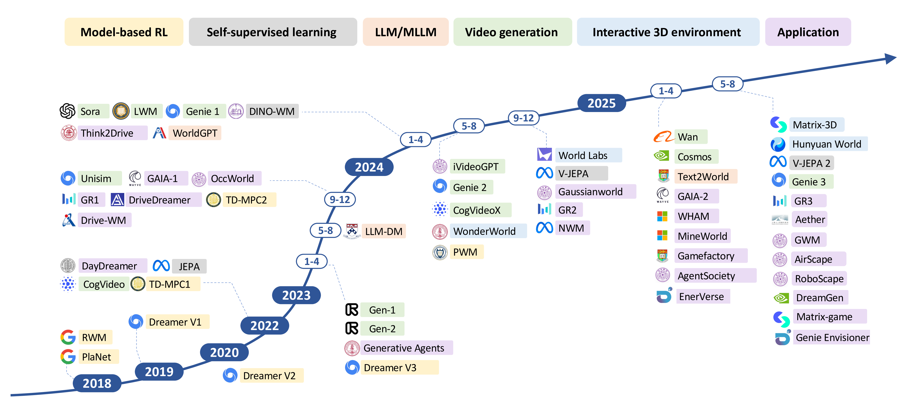

# Awesome-World-Model [](https://github.com/sindresorhus/awesome)

A curated list of awesome resources on World Models, based on the comprehensive survey "Understanding World or Predicting Future? A Comprehensive Survey of World Models".



## News🔥

* **[2024/11/21]** Initial release of our survey is available on [arXiv](https://arxiv.org/abs/2411.14499v1).
* **[2025/06/13]** Our survey paper "Understanding World or Predicting Future? A Comprehensive Survey of World Models" has been accepted by [ACM Computing Surveys](https://dl.acm.org/doi/abs/10.1145/3746449).
* **[2025/06/25]** Second version of our survey is available on [arXiv](https://arxiv.org/abs/2411.14499).
* **[2025/07/18]** Initial release of the Awesome-World-Model GitHub repository.

## Contact
If you have any suggestions or find our work helpful, feel free to contact us  
Email: dingjt15@tsinghua.org.cn

If this list helps your research, please ⭐ and cite:

```bibtex
@article{ding2025worldmodels,
  title={Understanding World or Predicting Future? A Comprehensive Survey of World Models},
  author={Ding, Jingtao and Zhang, Yunke and Shang, Yu and Zhang, Yuheng and Zong, Zefang and Feng, Jie and Yuan, Yuan and Su, Hongyu and Li, Nian and Sukiennik, Nicholas and Xu, Fengli and Li, Yong},
  journal={ACM Computing Surveys},
  year={2025}
}
```

## Table of Contents 🍃

* [Roadmap of world models in deep learning era](#Roadmap-of-world-models-in-deep-learning-era)
    * [Model-based RL](#Model-based-RL)
    * [Self-supervised learning](#Self-supervised-learning)
    * [LLM/MLLM](#LLMMLLM)
    * [Interactive 3D environment](#Interactive-3D-environment)

* [3 Implicit Representation of the External World](#3-implicit-representation-of-the-external-world)
    * [3.1 World Model in Decision Making](#31-world-model-decision-making)
    * [3.2 World Knowledge Learned by Models](#32-world-knowledge-learned)
* [4 Future Prediction of the Physical World](#4-future-predictions-of-the-external-world)
    * [4.1 World Model as Video Generation](#41-what-to-predict)
    * [4.2 World Model as Embodied Environment](#42-how-to-predict)
* [5 Applications of World Models](#5-applications-of-world-models)
    * [5.1 Game Intelligence](#51-Game-Intelligence)
    * [5.2 Embodied Intelligence](#52-Embodied-Intelligence)
    * [5.3 Urban Intelligence](#53-Urban-Intelligence)
    * [5.4 Societal Intelligence](#54-Societal-Intelligence)

## Roadmap of world models in deep learning era


### Model-based RL

| Title                                                        | Pub. & Date  | Code/Project URL                                             |
| ------------------------------------------------------------ | ------------ | ------------------------------------------------------------ |
| [Recurrent world models facilitate policy evolution  **(RWM)**](https://proceedings.neurips.cc/paper/2018/file/2de5d16682c3c35007e4e92982f1a2ba-Paper.pdf) | NeurIPS 2018 | [](https://worldmodels.github.io/) |
| [Learning Latent Dynamics for Planning from Pixels  **(PlaNet)**](https://arxiv.org/pdf/1811.04551) | ICML 2019    | [](https://github.com/google-research/planet) |
| [Dream to control: Learning behaviors by latent imagination  **(Dreamer V1)**](https://arxiv.org/pdf/1912.01603) | ICLR 2020    | [](https://github.com/danijar/dreamer) |
| [Mastering atari with discrete world models  **(Dreamer V2)**](https://arxiv.org/pdf/2010.02193) | ICLR 2021    | [](https://github.com/danijar/dreamerv2) |
| [Temporal Difference Learning for Model Predictive Control  **(TD-MPC1)**](https://arxiv.org/pdf/2203.04955) | ICML 2023    | [](https://github.com/nicklashansen/tdmpc) |
| [Mastering Diverse Domains through World Models  **(Dreamer V3)**](https://arxiv.org/pdf/2301.04104) | 2023         | [](https://github.com/danijar/dreamerv3) |
| [TD-MPC2: Scalable, Robust World Models for Continuous Control  **(TD-MPC2)**](https://openreview.net/pdf?id=Oxh5CstDJU) | ICLR 2024    | [](https://github.com/nicklashansen/tdmpc2) |
| [PWM: Policy Learning with Multi-Task World Models  **(PWM)**](https://openreview.net/pdf?id=Oxh5CstDJU) | ICLR 2025    | [](https://github.com/imgeorgiev/PWM) |


### Self-supervised learning

| Title                                                        | Pub.&Date | Code/Project URL                                             |
| ------------------------------------------------------------ | --------- | ------------------------------------------------------------ |
| [A path towards autonomous machine intelligence version 0.9. 2, 2022-06-27  **(JEPA)**](https://openreview.net/pdf?id=BZ5a1r-kVsf) | 2024      | —                                                            |
| [DINO-WM: World Models on Pre-trained Visual Features enable Zero-shot Planning  **(DINO-WM)**](https://arxiv.org/pdf/2411.04983) | 2024      | [](https://github.com/gaoyuezhou/dino_wm) |
| [Revisiting Feature Prediction for Learning Visual Representations from Video  **(V-JEPA)**](https://arxiv.org/pdf/2404.08471) | 2024      | [](https://github.com/facebookresearch/jepa) |
| [V-JEPA 2: Self-Supervised Video Models Enable Understanding, Prediction and Planning  **(V-JEPA2)**](https://arxiv.org/pdf/2506.09985) | 2025      | [](https://github.com/facebookresearch/vjepa2) |


### LLM/MLLM

| Title                                                        | Pub.&Date    | Code/Project URL                                             |
| ------------------------------------------------------------ | ------------ | ------------------------------------------------------------ |
| [Leveraging Pre-trained Large Language Models to Construct and Utilize World Models for Model-based Task Planning  **(LLM-DM)**](https://proceedings.neurips.cc/paper_files/paper/2023/file/f9f54762cbb4fe4dbffdd4f792c31221-Paper-Conference.pdf) | NeurIPS 2023 | [](https://github.com/GuanSuns/LLMs-World-Models-for-Planning) |
| [WorldGPT: Empowering LLM as Multimodal World Model  **(WorldGPT)**](https://dl.acm.org/doi/pdf/10.1145/3664647.3681488) | ACM MM 2024  | [](https://github.com/DCDmllm/WorldGPT) |
| [Text2World: Benchmarking Large Language Models for Symbolic World Model Generation  **(Text2World)**](https://arxiv.org/pdf/2502.13092) | ACL 2025     | [](https://github.com/Aaron617/text2world) |


### Video generation

| Title                                                        | Pub.&Date    | Code/Project URL                                             |
| ------------------------------------------------------------ | ------------ | ------------------------------------------------------------ |
| [CogVideo: Large-scale Pretraining for Text-to-Video Generation via Transformers  **(CogVideo)**](https://arxiv.org/pdf/2205.15868) | ICLR 2023    | [](https://github.com/zai-org/CogVideo) |
| [Structure and Content-Guided Video Synthesis with Diffusion Models  **(Gen‑1)**](https://arxiv.org/pdf/2508.08086) | ICCV 2023    | [](https://runwayml.com/research/gen-1) |
| [UniSim: Learning Interactive Real-World Simulators  **(Unisim)**](https://openreview.net/pdf?id=sFyTZEqmUY) | ICLR 2024    | [](https://universal-simulator.github.io/unisim/) |
| [Sora: Creating video from text  **(Sora)**](https://openai.com/sora) | OpenAI 2024  | —                                                            |
| [World model on million-length video and language with ring-attention  **(LWM)**](https://arxiv.org/pdf/2402.08268) | ICLR 2025    | [](https://github.com/LargeWorldModel/lwm) |
| [Genie: Generative Interactive Environmentsn  **(Genie)**](https://openreview.net/pdf?id=bJbSbJskOS) | ICML 2024    | [](https://sites.google.com/view/genie-2024/home) |
| [iVideoGPT: Interactive VideoGPTs are Scalable World Models  **(iVideoGPT)**](https://arxiv.org/pdf/2405.15223) | NeurIPS 2024 | [](https://github.com/thuml/iVideoGPT) |
| [CogVideoX: Text-to-Video Diffusion Models with An Expert Transformer  **(CogVideoX)**](https://arxiv.org/pdf/2408.06072) | ICLR 2025    | [](https://github.com/zai-org/CogVideo) |
| [Wan: Open and Advanced Large-Scale Video Generative Models  **(Wan)**](https://arxiv.org/pdf/2507.21809) | 2025         | [](https://github.com/Wan-Video/Wan2.1) |
| [Cosmos World Foundation Model Platform for Physical AI  **(Cosmos)**](https://arxiv.org/pdf/2501.03575) | 2025         | [](https://github.com/nvidia-cosmos/cosmos-predict2) |


### Interactive 3D environment

| Title                                                        | Pub.&Date | Code/Project URL                                             |
| ------------------------------------------------------------ | --------- | ------------------------------------------------------------ |
| [Interactive 3D Scene Generation from a Single Image  **(WonderWorld)**](https://arxiv.org/pdf/2308.07540) | CVPR 2025 | [](https://github.com/KovenYu/WonderWorld) |
| [Matrix-3D: Omnidirectional Explorable 3D World Generation  **(Matrix-3D)**](https://arxiv.org/pdf/2508.08086) | 2025      | [](https://github.com/SkyworkAI/Matrix-3D) |
| [HunyuanWorld 1.0: Generating Immersive, Explorable, and Interactive 3D Worlds from Words or Pixels  **(Hunyuan World)**](https://arxiv.org/pdf/2507.21809) | 2025      | [](https://github.com/Tencent-Hunyuan/HunyuanWorld-1.0) |

### 

## 3 Implicit Representation of the External World

### 3.1 World Model in Decision Making

| Title | Pub. & Date | Code/Project URL |
|---|---|---|
| [Deep reinforcement learning in a handful of trials using probabilistic dynamics models](https://proceedings.neurips.cc/paper_files/paper/2018/file/3de568f8597b94bda53149c7d7f5958c-Paper.pdf) | NeurIPS 2018 | [](https://github.com/kchua/handful-of-trials) |
| [PWM: Policy Learning with Multi-Task World Models](https://arxiv.org/pdf/2407.02466) | ICLR 2025 | [](https://github.com/imgeorgiev/PWM) |
| [Recurrent world models facilitate policy evolution](https://proceedings.neurips.cc/paper/2018/file/2de5d16682c3c35007e4e92982f1a2ba-Paper.pdf) | NeurIPS 2018 | [](https://worldmodels.github.io/) |
| [Dream to control: Learning behaviors by latent imagination](https://arxiv.org/pdf/1912.01603) | ICLR 2020 | [](https://github.com/danijar/dreamer) |
| [Leveraging pre-trained large language models to construct and utilize world models for model-based task planning](https://arxiv.org/pdf/2305.14909) | NeurIPS 2023 | [](https://github.com/GuanSuns/LLMs-World-Models-for-Planning) |
| [Mastering atari with discrete world models](https://arxiv.org/pdf/2010.02193) | ICLR 2021 | [](https://github.com/danijar/dreamerv2) |
| [Mastering diverse control tasks through world models](https://arxiv.org/pdf/2301.04104) | Nature 2024 | [](https://github.com/danijar/dreamerv3) |
| [TD-MPC2: Scalable, Robust World Models for Continuous Control](https://openreview.net/pdf?id=Oxh5CstDJU) | ICLR 2024 | [](https://github.com/nicklashansen/tdmpc2) |
| [When to trust your model: Model-based policy optimization](https://arxiv.org/pdf/1906.08253) | NeurIPS 2019 | [](https://github.com/jannerm/mbpo) |
| [Offline reinforcement learning as one big sequence modeling problem](https://proceedings.neurips.cc/paper/2021/file/099fe6b0b444c23836c4a5d07346082b-Paper.pdf) | NeurIPS 2021 | [](https://github.com/jannerm/trajectory-transformer) |
| [Model predictive control](https://link.springer.com/content/pdf/10.1007/978-3-319-24853-0.pdf) | Springer | — |
| [Algorithmic framework for model-based deep reinforcement learning with theoretical guarantees](https://openreview.net/pdf?id=BJe1E2R5KX) | ICLR 2019 | [](https://github.com/roosephu/slbo) |
| [Neural network dynamics for model-based deep reinforcement learning with model-free fine-tuning](https://arxiv.org/pdf/1708.02596) | ICRA 2018 | [](https://github.com/anagabandi/nn_dynamics) |
| [A game theoretic framework for model based reinforcement learning](https://arxiv.org/pdf/2004.07804) | ICML 2021 | [](https://github.com/aravindr93/mjrl/tree/v2) |
| [General agents need world models](https://arxiv.org/pdf/2506.01622) | ICML 2025    | — |
| [Mastering memory tasks with world models](https://arxiv.org/abs/2403.04253) | ICLR 2024 | [](https://github.com/chandar-lab/Recall2Imagine) |
| [A generalist dynamics model for control](https://arxiv.org/abs/2305.10912) | arXiv 2023 | — |
| [Exploring model-based planning with policy networks](https://openreview.net/pdf?id=H1exf64KwH) | ICLR 2020 | [](https://github.com/WilsonWangTHU/POPLIN) |
| [A0c: Alpha zero in continuous action space](https://arxiv.org/abs/1805.09613) | arXiv 2018 | [](https://github.com/tmoer/a0c) |
| [Probabilistic adaptation of text-to-video models](https://arxiv.org/pdf/2306.01872v1) | ICLR 2024 | [](https://video-adapter.github.io/video-adapter/) |
| [RoboDreamer: Learning Compositional World Models for Robot Imagination](https://openreview.net/pdf?id=kHjOmAUfVe) | ICML 2024 | [](https://github.com/rainbow979/robodreamer) |
| [Discuss before moving: Visual language navigation via multi-expert discussions](https://arxiv.org/pdf/2309.11382) | ICRA 2024 | [](https://github.com/LYX0501/DiscussNav) |
| [OVER-NAV: Elevating Iterative Vision-and-Language Navigation with Open-Vocabulary Detection and Structured Representation](https://openaccess.thecvf.com/content/CVPR2024/papers/Zhao_OVER-NAV_Elevating_Iterative_Vision-and-Language_Navigation_with_Open-Vocabulary_Detection_and_StructurEd_CVPR_2024_paper.pdf) | CVPR 2024 | [](https://github.com/uitrbn/OVER-NAV-IVLN-CE) |
| [RILA: Reflective and Imaginative Language Agent for Zero-Shot Semantic Audio-Visual Navigation](https://openaccess.thecvf.com/content/CVPR2024//papers/Yang_RILA_Reflective_and_Imaginative_Language_Agent_for_Zero-Shot_Semantic_Audio-Visual_CVPR_2024_paper.pdf) | CVPR 2024 | [](https://rila-savn.github.io/RILA/) |
| [Towards Large Reasoning Models: A Survey of Reinforced Reasoning with Large Language Models](https://arxiv.org/pdf/2501.09686) | arXiv 2025 | — |
| [Position: LLMs can't plan, but can help planning in LLM-modulo frameworks](https://arxiv.org/pdf/2402.01817) | ICML 2024 | — |
| [Language models meet world models: Embodied experiences enhance language models](https://proceedings.neurips.cc/paper_files/paper/2023/file/ee6630dcbcff857026e474fc857aa9f0-Paper-Conference.pdf#:~:text=In%20this%20paper%2C%20we%20propose%20a%20new%20paradigm,embodied%20knowledge%20while%20retaining%20their%20general%20language%20capabilities.) | NeurIPS 2023 | [](https://github.com/szxiangjn/world-model-for-language-model) |
| [Virtualhome: Simulating household activities via programs](https://openaccess.thecvf.com/content_cvpr_2018/papers/Puig_VirtualHome_Simulating_Household_CVPR_2018_paper.pdf) | CVPR 2018 | [](https://github.com/xavierpuigf/virtualhome) |
| [Learning to Model the World with Language](https://arxiv.org/pdf/2308.01399) | ICML 2024 | [](https://github.com/jlin816/dynalang) |
| [Reason for Future, Act for Now: A Principled Framework for Autonomous LLM Agents with Provable Sample Efficiency](https://arxiv.org/abs/2309.17382) | ICML 2024 | [](https://github.com/agentification/RAFA_code) |
| [Alfworld: Aligning text and embodied environments for interactive learning](https://arxiv.org/pdf/2010.03768) | ICLR 2021 | [](https://github.com/alfworld/alfworld) |
| [Is Your LLM Secretly a World Model of the Internet? Model-Based Planning for Web Agents](https://arxiv.org/abs/2411.06559) | EMNLP 2024 | [](https://github.com/OSU-NLP-Group/WebDreamer) |
| [Agent Planning with World Knowledge Model](https://arxiv.org/pdf/2405.14205) | NeurIPS 2024 | [](https://github.com/zjunlp/WKM) |
| [WorldCoder, a Model-Based LLM Agent: Building World Models by Writing Code and Interacting with the Environment](https://arxiv.org/pdf/2402.12275) | NeurIPS 2024 | [](https://github.com/haotang1995/WorldCoder) |
| [Web Agents with World Models: Learning and Leveraging Environment Dynamics in Web Navigation](https://arxiv.org/pdf/2410.13232) | ICLR 2025 | [](https://github.com/kyle8581/WMA-Agents) |


### 3.2 World Knowledge Learned by Models

| Title | Pub. & Date | Code / Project URL |
|---|---|---|
| [Does the chimpanzee have a theory of mind?](https://www.cambridge.org/core/services/aop-cambridge-core/content/view/1E96B02CD9850016B7C93BC6D2FEF1D0/S0140525X00076512a.pdf/does-the-chimpanzee-have-a-theory-of-mind.pdf) | Behav. & Brain Sci. 1978 | — |
| [GPT4GEO: How a Language Model Sees the World’s Geography](https://arxiv.org/pdf/2306.00020) | NeurIPS  2023 | [](https://github.com/jonathan-roberts1/GPT4GEO) |
| [LLMs achieve adult human performance on higher-order theory of mind tasks](https://arxiv.org/pdf/2405.18870) | arXiv 2024 | — |
| [COKE: A cognitive knowledge graph for machine theory of mind](https://aclanthology.org/2024.acl-long.848.pdf) | ACL 2024 | [](https://github.com/jincenziwu/COKE) |
| [Think Twice: Perspective-Taking Improves LLM Theory-of-Mind](https://arxiv.org/pdf/2311.10227) | ACL 2024 | [](https://github.com/shawnsihyunlee/simulatedtom) |
| [Language Models Represent Space and Time](https://arxiv.org/pdf/2310.02207) | ICLR 2024 | [](https://github.com/wesg52/world-models) |
| [GeoLLM: Extracting Geospatial Knowledge from Large Language Models](https://arxiv.org/pdf/2310.06213) | ICLR 2024 | [](https://github.com/rohinmanvi/GeoLLM) |
| [Large language models are geographically biased](https://arxiv.org/pdf/2402.02680) | ICML 2024 | [](https://github.com/rohinmanvi/GeoLLM) |
| [Emergent Representations of Program Semantics in Language Models Trained on Programs](https://openreview.net/pdf?id=zRrzSLwNHQ) | ICML 2024 | [](https://github.com/charlesjin/emergent-semantics) |
| [BLEnD: A Benchmark for LLMs on Everyday Knowledge in Diverse Cultures and Languages](https://arxiv.org/pdf/2406.09948) | NeurIPS 2024 | [](https://github.com/nlee0212/BLEnD) |
| [SafeWorld: Geo-Diverse Safety Alignment](https://arxiv.org/pdf/2412.06483) | NeurIPS 2024 | [](https://github.com/PlusLabNLP/SafeWorld) |
| [EAI: Emotional Decision-Making of LLMs in Strategic Games and Ethical Dilemmas](https://openreview.net/forum?id=8aAaYEwNR4) | NeurIPS 2024 | [](https://github.com/AIRI-Institute/EAI-Framework) |
| [Testing theory of mind in large language models and humans](https://www.nature.com/articles/s41562-024-01882-z) | Nature Human Behaviour 2024 | [Website](https://osf.io/j3vhq) |
| [Automated construction of cognitive maps with visual predictive coding](https://www.nature.com/articles/s42256-024-00863-1) | Nature Machine Intelligence 2024 | [](https://github.com/jgornet/predictive-coding-recovers-maps) |
| [Evaluating Large Language Models in Theory of Mind Tasks](https://www.pnas.org/doi/10.1073/pnas.2405460121) | PNAS 2024 | [Website](https://osf.io/csdhb/) |
| [Elements of World Knowledge (EWOK)](https://arxiv.org/pdf/2405.09605) | Transactions of the ACL 2025 | [Website](https://ewok-core.github.io/) |
| [The Geometry of Concepts: Sparse Autoencoder Feature Structure](https://arxiv.org/abs/2410.19750) | Entropy 2025 | [](https://github.com/ejmichaud/feature-geometry) |
| [AgentMove: A large language model based agentic framework for zero-shot next location prediction](https://arxiv.org/abs/2408.13986) | NAACL 2025 | [](https://github.com/tsinghua-fib-lab/AgentMove) |
| [CityGPT: Empowering Urban Spatial Cognition of Large Language Models](https://arxiv.org/abs/2406.13948) | KDD 2025 | [](https://github.com/tsinghua-fib-lab/CityGPT) |
| [CityBench: Evaluating the Capabilities of Large Language Model as World Model](https://arxiv.org/abs/2406.13945) | KDD 2025 | [](https://github.com/tsinghua-fib-lab/CityBench) |
| [LocalGPT: Benchmarking and Advancing Large Language Models for Local Life Services](https://www.arxiv.org/abs/2506.02720) | KDD 2025 | [](https://github.com/tsinghua-fib-lab/LocalEval) |
| [UrbanLLaVA: A Multi-modal Large Language Model for Urban Intelligence](https://arxiv.org/abs/2506.23219) | ICCV 2025 | [](https://github.com/tsinghua-fib-lab/UrbanLLaVA) |
| [Open-Set Living Need Prediction with Large Language Models](https://arxiv.org/abs/2506.02713) | ACL 2025 Findings | [](https://github.com/tsinghua-fib-lab/PIGEON) |
| [Do Vision-Language Models Have Internal World Models? Towards an Atomic Evaluation](https://arxiv.org/abs/2506.21876) | ACL 2025 Findings | [Website](https://wm-abench.maitrix.org/) |
| [Mitigating Geospatial Knowledge Hallucination in Large Language Models: Benchmarking and Dynamic Factuality Aligning](https://arxiv.org/abs/2507.19586) | EMNLP 2025 Findings |[](https://github.com/tsinghua-fib-lab/GeospatialHallucination) |
| [GPS as a Control Signal for Image Generation](https://arxiv.org/abs/2501.12390) | CVPR 2025 | [](https://github.com/cfeng16/GPS2Pix) |
| [All Languages Matter: Evaluating LMMs on Culturally Diverse 100 Languages](https://arxiv.org/abs/2411.16508) | CVPR 2025 | [Website](https://mbzuai-oryx.github.io/ALM-Bench/) |
| [Spatial457: A Diagnostic Benchmark for 6D Spatial Reasoning of Large Multimodal Models](https://arxiv.org/abs/2502.08636) | CVPR 2025 | [](https://github.com/XingruiWang/Spatial457) |
| [Thinking in Space: How Multimodal Large Language Models See, Remember, and Recall Spaces](https://arxiv.org/abs/2412.14171) | CVPR 2025 | [Website](https://vision-x-nyu.github.io/thinking-in-space.github.io/) |
| [A Survey of Large Language Model-Powered Spatial Intelligence Across Scales](https://arxiv.org/abs/2504.09848) | arXiv 2025 | — |
| [AI's Blind Spots: Geographic Knowledge and Diversity Deficit in Generated Urban Scenario](https://arxiv.org/pdf/2506.16898) | arXiv 2025 | — |
| [Recognition through Reasoning: Reinforcing Image Geo-localization with Large Vision-Language Models](https://arxiv.org/pdf/2506.14674) | arXiv 2025 | — |

## 4 Future Prediction of the Physical World

### 4.1 World Model as Video Generation

| Title                                                        | Pub. & Date      | Code / Project URL                                           |
| ------------------------------------------------------------ | ---------------- | ------------------------------------------------------------ |
| [Video generation models as world simulators](https://openai.com/research/video-generation-models-as-world-simulators) | OpenAI Blog 2024 | —                                                            |
| [Sora: Creating video from text](https://openai.com/sora)    | OpenAI 2024      | —                                                            |
| [Is Sora a world simulator? A comprehensive survey on general world models and beyond](https://arxiv.org/pdf/2405.03520) | arXiv 2024       | [](https://github.com/GigaAI-research/General-World-Models-Survey) |
| [Sora as an AGI world model? A complete survey on text-to-video generation](https://arxiv.org/pdf/2403.05131) | arXiv 2024       | —                                                            |
| [How Far is Video Generation from World Model: A Physical Law Perspective](https://arxiv.org/pdf/2411.02385) | ICML 2025        | [](https://github.com/phyworld/phyworld) |
| [Do generative video models learn physical principles from watching videos?](https://arxiv.org/pdf/2501.09038) | arXiv 2025       | [](https://github.com/google-deepmind/physics-IQ-benchmark) |
| [Genesis: A Generative and Universal Physics Engine for Robotics and Beyond](https://arxiv.org/pdf/2405.18556) | ICML 2024        | [](https://github.com/Genesis-Embodied-AI/Genesis) |
| [PhysGen: Rigid-body physics-grounded image-to-video generation](https://arxiv.org/pdf/2409.18964) | ECCV 2024        | [](https://github.com/stevenlsw/physgen) |
| [NUWA-XL: Diffusion over Diffusion for Extremely Long Video Generation](https://arxiv.org/pdf/2303.12346) | ACL 2023         | [Website](https://msra-nuwa.azurewebsites.net/#/)            |
| [OccWorld: Learning a 3D Occupancy World Model for Autonomous Driving](https://arxiv.org/pdf/2311.16038) | ECCV 2024        | [](https://github.com/wzzheng/OccWorld) |
| [OccSora: 4D Occupancy Generation Models as World Simulators](https://openreview.net/pdf?id=XIFnghzusY) | ICLR 2025        | [](https://github.com/wzzheng/OccSora) |
| [World model on million-length video and language with ring-attention](https://arxiv.org/pdf/2402.08268) | ICLR 2025        | [](https://github.com/LargeWorldModel/lwm) |
| [GAIA-1: A generative world model for autonomous driving](https://arxiv.org/pdf/2309.17080) | arXiv 2023       | [Website](https://anthonyhu.github.io/gaia1)                 |
| [DriveDreamer: Towards real-world-driven world models](https://arxiv.org/pdf/2309.09777) | ECCV 2024        | [](https://github.com/JeffWang987/DriveDreamer) |
| [DriveDreamer-2: LLM-Enhanced World Models for Diverse Driving Video Generation](https://arxiv.org/pad/2403.06845) | AAAI 2025        | [](https://github.com/f1yfisher/DriveDreamer2) |
| [Driving into the Future: Multiview Visual Forecasting and Planning with World Model](https://arxiv.org/pdf/2311.17918) | CVPR 2024        | [](https://github.com/BraveGroup/Drive-WM) |
| [Vista: A Generalizable Driving World Model with High Fidelity](https://arxiv.org/pdf/2405.17398) | NeurIPS 2024     | [](https://github.com/OpenDriveLab/Vista) |
| [WorldDreamer: Towards general world models for video generation](https://arxiv.org/abs/2401.09985) | arXiv 2024       | [](https://github.com/JeffWang987/WorldDreamer) |
| [WorldGPT: a Sora-inspired video AI agent](https://arxiv.org/abs/2403.07944) | arXiv 2024       | —                                                            |


### 4.2 World Model as Embodied Environment

| Title | Pub. & Date | Code / Project URL |
|---|---|---|
| [Holodeck: Language guided generation of 3d embodied ai environments](https://openaccess.thecvf.com/content/CVPR2024/papers/Yang_Holodeck_Language_Guided_Generation_of_3D_Embodied_AI_Environments_CVPR_2024_paper.pdf) | CVPR 2024 | [](https://github.com/allenai/Holodeck) |
| [GRUtopia: Dream General Robots in a City at Scale](https://arxiv.org/abs/2407.10943) | arXiv 2024 | [](https://github.com/InternRobotics/InternUtopia) |
| [Anyhome: Open-vocabulary generation of structured and textured 3d homes](https://arxiv.org/abs/2312.06644) | ECCV 2024 | [](https://github.com/FreddieRao/anyhome_github) |
| [LEGENT: Open Platform for Embodied Agents](https://arxiv.org/abs/2404.18243) | arXiv 2024 | [](https://github.com/thunlp/LEGENT) |
| [UrbanWorld: An Urban World Model for 3D City Generation](https://arxiv.org/abs/2407.11965) | arXiv 2024 | [](https://github.com/Urban-World/UrbanWorld) |
| [MetaUrban: An Embodied AI Simulation Platform for Urban Micromobility](https://arxiv.org/pdf/2407.08725) | ICLR 2025 | [](https://github.com/metadriverse/metaurban) |
| [Minedojo: Building open-ended embodied agents with internet-scale knowledge](https://arxiv.org/abs/2206.08853) | NeurIPS 2022 | [](https://github.com/MineDojo/MineDojo) |
| [UniSim: Learning Interactive Real-World Simulators](https://openreview.net/pdf?id=sFyTZEqmUY) | ICLR 2024 | [](https://universal-simulator.github.io/unisim/) |
| [EmbodiedCity: A Benchmark Platform for Embodied Agent in Real-world City Environment](https://arxiv.org/abs/2410.09604) | arXiv 2024 | [](https://github.com/tsinghua-fib-lab/EmbodiedCity) |
| [Empowering World Models with Reflection for Embodied Video Prediction](https://arxiv.org/abs/2410.15461) | ICML 2025 | — |
| [Streetscapes: Large-scale consistent street view generation using autoregressive video diffusion](https://arxiv.org/abs/2406.03578) | SIGGRAPH 2024 | — |
| [AVID: Adapting Video Diffusion Models to World Models](https://arxiv.org/abs/2410.12822) | arXiv 2024 | [](https://github.com/microsoft/causica/tree/main/research_experiments/avid) |
| [Pandora: Towards General World Model with Natural Language Actions and Video States](https://arxiv.org/abs/2406.09455) | arXiv 2024 | [](https://github.com/maitrix-org/Pandora) |
| [RoboScape: Physics-informed Embodied World Model](https://arxiv.org/abs/2506.23135) | arXiv 2025 | [](https://github.com/tsinghua-fib-lab/RoboScape) |
| [TesserAct: Learning 4D Embodied World Models](https://arxiv.org/abs/2504.20995) | arXiv 2025 | [](https://github.com/UMass-Embodied-AGI/TesserAct) |

## 5 Applications of World Models

### 5.1 Game Intelligence

| Title                                                        | Pub. & Date | Code / Project URL                                           |
| ------------------------------------------------------------ | ----------- | ------------------------------------------------------------ |
| [World and Human Action Models towards Gameplay Ideation](https://www.nature.com/articles/s41586-025-08600-3.pdf) | Nature 2025 | —                                                            |
| [GameFactory: Creating New Games with Generative Interactive Videos](https://arxiv.org/pdf/2501.08325) | ICCV 2025   | [](https://github.com/KwaiVGI/GameFactory) |
| [Unbounded: A Generative Infinite Game of Character Life Simulation](https://arxiv.org/pdf/2410.18975) | CVPR 2025   | [Website](https://generative-infinite-game.github.io/)       |
| [GameGen-𝕏: Interactive Open-world Game Video Generation](https://arxiv.org/pdf/2411.00769) | ICLR 2025   | [](https://github.com/GameGen-X/GameGen-X) |
| [Diffusion Models Are Real-Time Game Engines](https://arxiv.org/pdf/2408.14837?) | ICLR 2025   | [Website](https://gamengen.github.io/)                       |
| [Exploration-Driven Generative Interactive Environments](https://arxiv.org/pdf/2506.09985) | ICLR 2025   | [](https://github.com/facebookresearch/vjepa2) |
| [Matrix-Game: Interactive World Foundation Model](https://arxiv.org/pdf/2506.18701) | arXiv 2025  | [](https://github.com/SkyworkAI/Matrix-Game) |
| [Mineworld: a Real-time and Open-source Interactive World Model on Minecraft](https://arxiv.org/pdf/2504.08388?) | arXiv 2025  | [](https://github.com/microsoft/MineWorld) |
| [Model as a Game: On Numerical and Spatial Consistency for Generative Games](https://arxiv.org/pdf/2503.21172?) | arXiv 2025  | —                                                            |


### 5.2 Embodied Intelligence

| Title                                                        | Pub. & Date  | Code / Project URL                                           |
| ------------------------------------------------------------ | ------------ | ------------------------------------------------------------ |
| [OpenEQA: Embodied Question Answering in the Era of Foundation Models](https://open-eqa.github.io/assets/pdfs/paper.pdf) | CVPR 2024    | [](https://github.com/facebookresearch/open-eqa) |
| [iVideoGPT: Interactive VideoGPTs are Scalable World Models](https://arxiv.org/abs/2405.15223) | NeurIPS 2024 | [](https://github.com/thuml/iVideoGPT) |
| [IRASim: A Fine-Grained World Model for Robot Manipulation](https://arxiv.org/abs/2406.14540) | ICCV 2025    | [](https://github.com/bytedance/IRASim) |
| [RoboScape: Physics-informed Embodied World Model](https://arxiv.org/abs/2506.23135) | arXiv 2025   | [](https://github.com/tsinghua-fib-lab/RoboScape) |
| [TesserAct: Learning 4D Embodied World Models](https://arxiv.org/abs/2504.20995) | arXiv 2025   | [](https://github.com/UMass-Embodied-AGI/TesserAct) |
| [V-JEPA 2: Self-Supervised Video Models Enable Understanding, Prediction and Planning](https://arxiv.org/abs/2506.09985) | arXiv 2025   | [](https://github.com/facebookresearch/vjepa2) |
| [Video Prediction Policy: A Generalist Robot Policy with Predictive Visual Representations](https://arxiv.org/abs/2412.14803) | ICML 2025    | [](https://github.com/roboterax/video-prediction-policy) |
| [DreamGen: Unlocking Generalization in Robot Learning through Video World Models](https://arxiv.org/abs/2505.12705) | arXiv 2025   | [](https://github.com/NVIDIA/GR00T-Dreams) |
| [EnerVerse: Envisioning Embodied Future Space for Robotics Manipulation](https://arxiv.org/abs/2501.01895) | arXiv 2025   | [Website](https://sites.google.com/view/enerverse)           |
| [EnerVerse-AC: Envisioning Embodied Environments with Action Condition](https://arxiv.org/abs/2505.09723) | arXiv 2025   | [](https://github.com/AgibotTech/EnerVerse-AC) |
| [Genie Envisioner: A Unified World Foundation Platform for Robotic Manipulation](https://arxiv.org/abs/2508.05635v1) | arXiv 2025   | [](https://github.com/AgibotTech/Genie-Envisioner) |
| [Vidar: Embodied Video Diffusion Model for Generalist Bimanual Manipulation](https://arxiv.org/abs/2507.12898) | arXiv 2025   | —                                                            |
| [WorldVLA: Towards Autoregressive Action World Model](https://arxiv.org/abs/2506.21539) | arXiv 2025   | [](https://github.com/alibaba-damo-academy/WorldVLA) |
| [ManiGaussian++: General Robotic Bimanual Manipulation with Hierarchical Gaussian World Model](https://arxiv.org/pdf/2506.19842) | arXiv 2025   | [](https://github.com/April-Yz/ManiGaussian_Bimanual) |
| [ORV: 4D Occupancy-centric Robot Video Generation](https://arxiv.org/abs/2506.03079) | arXiv 2025   | [](https://github.com/OrangeSodahub/ORV) |
| [GWM: Towards Scalable Gaussian World Models for Robotic Manipulation](https://arxiv.org/pdf/2508.17600) | ICCV 2025    | [Website](https://gaussian-world-model.github.io/)           |
| [WorldEval: World Model as Real-World Robot Policies Evaluator](https://arxiv.org/abs/2505.19017) | arXiv 2025   | [](https://github.com/liyaxuanliyaxuan/Worldeval) |


### 5.3 Urban Intelligence

##### Autonomous Driving

| Title | Pub. & Date | Code / Project URL |
|---|---|---|
| [Video generation models as world simulators](https://openai.com/research/video-generation-models-as-world-simulators) | OpenAI Research (2024) | [Website](https://openai.com/research/video-generation-models-as-world-simulators) |
| [GPT-4 technical report](https://arxiv.org/abs/2303.08774) | arXiv 2023 | — |
| [Visual Instruction Tuning](https://arxiv.org/abs/2304.08485) | NeurIPS 2023 | [](https://github.com/haotian-liu/LLaVA) |
| [World models for autonomous driving: An initial survey](https://ieeexplore.ieee.org/stamp/stamp.jsp?tp=&arnumber=10522953) | IEEE T-IV 2024 | — |
| [Waymax: An accelerated, data-driven simulator for large-scale autonomous driving research](https://arxiv.org/pdf/2310.17918) | arXiv 2023 | [](https://github.com/waymo-research/waymax) |
| [Planning-oriented autonomous driving](https://arxiv.org/abs/2212.10156) | CVPR 2023 | [](https://github.com/OpenDriveLab/UniAD) |
| [A survey on trajectory-prediction methods for autonomous driving](https://ieeexplore.ieee.org/stamp/stamp.jsp?tp=&arnumber=9779556) | IEEE T-IV 2022 | — |
| [BEVFormer: Learning bird’s-eye-view representation from multi-camera images via spatiotemporal transformers](https://arxiv.org/abs/2203.17270) | ECCV 2022 | [](https://github.com/fundamentalvision/BEVFormer) |
| [Transfusion: Robust lidar-camera fusion for 3D object detection with transformers](https://openaccess.thecvf.com/content/CVPR2022/papers/Bai_TransFusion_Robust_LiDAR-Camera_Fusion_for_3D_Object_Detection_With_Transformers_CVPR_2022_paper.pdf) | CVPR 2022 | [](https://github.com/XuyangBai/TransFusion) |
| [YOLOP: You only look once for panoptic driving perception](https://link.springer.com/article/10.1007/s11633-022-1339-y) | MIR 2022 | [](https://github.com/hustvl/YOLOP) |
| [Wayformer: Motion forecasting via simple & efficient attention networks](https://arxiv.org/abs/2207.05844) | ICRA 2023 | — |
| [Motion Transformer with Global Intention Localization and Local Movement Refinement](https://papers.nips.cc/paper_files/paper/2022/file/2ab47c960bfee4f86dfc362f26ad066a-Paper-Conference.pdf) | NeurIPS 2022 | [](https://github.com/sshaoshuai/MTR) |
| [Query-Centric Trajectory Prediction](https://openaccess.thecvf.com/content/CVPR2023/papers/Zhou_Query-Centric_Trajectory_Prediction_CVPR_2023_paper.pdf) | CVPR 2023 | [](https://github.com/ZikangZhou/QCNet) |
| [HPTR: Real-time motion prediction via heterogeneous polyline transformer with relative pose encoding](https://arxiv.org/abs/2310.12970) | NeurIPS 2023 | [](https://github.com/zhejz/HPTR) |
| [MotionDiffuser: Controllable multi-agent motion prediction using diffusion](https://openaccess.thecvf.com/content/CVPR2023/papers/Jiang_MotionDiffuser_Controllable_Multi-Agent_Motion_Prediction_Using_Diffusion_CVPR_2023_paper.pdf) | CVPR 2023 | — |
| [Tokenize the world into object-level knowledge to address long-tail events in autonomous driving](https://arxiv.org/abs/2407.00959) | arXiv 2024 | — |
| [GAIA-1: A generative world model for autonomous driving](https://arxiv.org/abs/2309.17080) | arXiv 2023 | — |
| [DriveDreamer: Towards real-world-driven world models for autonomous driving](https://arxiv.org/abs/2309.09777) | ECCV 2024 | [](https://github.com/JeffWang987/DriveDreamer) |
| [Driving into the Future: Multiview Visual Forecasting and Planning with World Model for Autonomous Driving](https://arxiv.org/abs/2311.17918) | CVPR 2024 | [](https://github.com/BraveGroup/Drive-WM) |
| [OccWorld: Learning a 3D occupancy world model for autonomous driving](https://arxiv.org/abs/2311.16038) | ECCV 2024 | [](https://github.com/wzzheng/OccWorld) |
| [OccSora: 4D occupancy generation models as world simulators for autonomous driving](https://arxiv.org/abs/2405.20337) | arXiv 2024 | [](https://github.com/wzzheng/OccSora) |
| [Vista: A generalizable driving world model with high fidelity and versatile controllability](https://arxiv.org/abs/2405.17398) | NeurIPS 2024 | [](https://github.com/OpenDriveLab/Vista) |
| [Copilot4D: Learning unsupervised world models for autonomous driving via discrete diffusion](https://arxiv.org/abs/2311.01017) | ICLR 2024 | — |
| [MUVO: A multimodal generative world model for autonomous driving with geometric representations](https://arxiv.org/abs/2311.11762) | IEEE T-IV 2025 | [](https://github.com/fzi-forschungszentrum-informatik/muvo) |
| [UniWorld: Autonomous driving pre-training via world models](https://arxiv.org/abs/2308.07234) | arXiv 2023 | [](https://github.com/whuhxb/UniWorld) |
| [MetaUrban: A simulation platform for embodied AI in urban spaces](https://arxiv.org/abs/2407.08725) | ICLR 2025 | [](https://github.com/metadriverse/MetaUrban) |
| [UrbanWorld: An urban world model for 3D city generation](https://arxiv.org/abs/2407.11965) | arXiv 2024 | [](https://github.com/Urban-World/UrbanWorld) |
| [Streetscapes: Large-scale consistent street view generation using autoregressive video diffusion](https://arxiv.org/pdf/2407.13759) | SIGGRAPH 2024 | [Website](https://arxiv.org/pdf/2407.13759) |

##### Autonomous Logistics & Urban Analytics

| Title | Pub. & Date | Code / Project URL |
|---|---|---|
| [Navigation World Models](https://arxiv.org/abs/2412.03572) | CVPR 2025 | [](https://github.com/facebookresearch/nwm) |
| [Towards Autonomous Micromobility through Scalable Urban Simulation](https://arxiv.org/abs/2505.00690) | CVPR 2025 | [](https://github.com/metadriverse/urban-sim) |
| [Vid2Sim: Realistic and Interactive Simulation from Video for Urban Navigation](https://arxiv.org/abs/2501.06693) | CVPR 2025 | [](https://github.com/Vid2Sim/Vid2Sim) |
| [CityWalker: Learning Embodied Urban Navigation from Web-Scale Videos](https://arxiv.org/abs/2411.17820) | CVPR 2025 | [](https://github.com/ai4ce/CityWalker) |
| [AirScape: An Aerial Generative World Model with Motion Controllability](https://arxiv.org/abs/2507.08885) | ACM MM 2025 | — |
| [CityNavAgent: Aerial Vision-and-Language Navigation with Hierarchical Semantic Planning and Global Memory](https://arxiv.org/abs/2505.05622) | ACL 2025 | [](https://github.com/EmbodiedCity/CityNavAgent.code) |
| [CityEQA: A Hierarchical LLM Agent on Embodied Question Answering Benchmark in City Space](https://arxiv.org/abs/2502.12532) | EMNLP 2025 | [](https://github.com/BiluYong/CityEQA) |
| [UrbanVideo-Bench: Benchmarking Vision-Language Models on Embodied Intelligence with Video Data in Urban Spaces](https://arxiv.org/abs/2503.06157) | ACL 2025 | [](https://github.com/EmbodiedCity/UrbanVideo-Bench.code) |
| [GeoLLM: Extracting Geospatial Knowledge from Large Language Models](https://arxiv.org/abs/2310.06213) | ICLR 2024 | [](https://github.com/rohinmanvi/GeoLLM) |
| [CityGPT: Empowering Urban Spatial Cognition of Large Language Models](https://arxiv.org/abs/2406.13948) | KDD 2025 | [](https://github.com/tsinghua-fib-lab/CityGPT) |
| [UrbanLLaVA: A Multi-modal Large Language Model for Urban Intelligence](https://arxiv.org/abs/2506.23219) | ICCV 2025 | [](https://github.com/tsinghua-fib-lab/UrbanLLaVA) |
| [GPS as a Control Signal for Image Generation](https://arxiv.org/abs/2501.12390) | CVPR 2025 | [](https://github.com/cfeng16/GPS2Pix) |
| [AI's Blind Spots: Geographic Knowledge and Diversity Deficit in Generated Urban Scenario](https://arxiv.org/abs/2506.16898) | arXiv 2025 | — |
| [AgentMove: A Large Language Model based Agentic Framework for Zero-shot Next Location Prediction](https://aclanthology.org/2025.naacl-long.61/) | NAACL 2025 | [](https://github.com/tsinghua-fib-lab/AgentMove) |
| [CAMS: A CityGPT-Powered Agentic Framework for Urban Human Mobility Simulation](https://arxiv.org/abs/2506.13599) | arXiv 2025 | [](https://github.com/tsinghua-fib-lab/CAMS) |
| [Open-Set Living Need Prediction with Large Language Models](https://arxiv.org/abs/2506.02713) | ACL 2025 | [](https://github.com/tsinghua-fib-lab/PIGEON) |


### 5.4 Societal Intelligence

| Title                                                                                                                                   | Pub. & Date | Code / Project URL                                              |
| --------------------------------------------------------------------------------------------------------------------------------------- | ----------- | --------------------------------------------------------------- |
| [AgentSociety: Large-scale simulation of LLM-driven generative agents](https://arxiv.org/abs/2502.08691)                                | ACL 2025, COLM 2025 | [](https://github.com/tsinghua-fib-lab/AgentSociety)                    |
| [GenSim: A General Social Simulation Platform with Large Language Model based Agents](https://aclanthology.org/2025.naacl-demo.15/)             | NAACL 2025  | [](https://github.com/TangJiakai/GenSim)   |
| [Simulating Human-like Daily Activities with Desire-driven Autonomy](https://arxiv.org/abs/2412.06435)             | ICLR 2025  | [](https://github.com/zfw1226/D2A)   |
| [EconAgent: Large language model-empowered agents for simulating macroeconomic activities](https://aclanthology.org/2024.acl-long.829/) | ACL 2024    | [](https://github.com/tsinghua-fib-lab/ACL24-EconAgent)  |
| [Agent-Pro: Learning to evolve via policy-level reflection and optimization](https://aclanthology.org/2024.acl-long.292/)                          | ACL 2024  | [](https://github.com/zwq2018/Agent-Pro)                     |
| [Exploring collaboration mechanisms for LLM agents: A social psychology view](https://aclanthology.org/2024.acl-long.782/)                         | ACL 2024  | [](https://github.com/zjunlp/MachineSoM)                    |
| [Cooperate or Collapse: Emergence of sustainability behaviors in a society of LLM agents](https://neurips.cc/virtual/2024/poster/96895)             | NeurIPS 2024  | [](https://github.com/giorgiopiatti/GovSim)  |
| [SocioDojo: Building Lifelong Analytical Agents with Real-world Text and Time Series](https://iclr.cc/virtual/2024/poster/17662)             | ICLR 2024  | [](https://github.com/chengjunyan1/SocioDojo)   |
| [SRAP-Agent: Simulating and optimizing scarce resource allocation policy with LLM-based agent](https://aclanthology.org/2024.findings-emnlp.15/)        | EMNLP 2024  | [](https://github.com/Ji-Cather/SRAPAgent_Framework)                     |
| [Generative agents: Interactive simulacra of human behavior](https://dl.acm.org/doi/10.1145/3586183.3606763)                            | UIST 2023   | [](https://github.com/joonspk-research/generative_agents) |
| [SocioVerse: A World Model for Social Simulation Powered by LLM Agents and A Pool of 10 Million Real-World Users](https://arxiv.org/abs/2504.10157)             | arXiv 2025  | [](https://github.com/FudanDISC/SocioVerse)   |
| [YuLan-OneSim: Towards the Next Generation of Social Simulator with Large Language Models](https://arxiv.org/abs/2505.07581)             | arXiv 2025  | [](https://github.com/RUC-GSAI/YuLan-OneSim)   |
| [OASIS: Open Agent Social Interaction Simulations with One Million Agents](https://arxiv.org/abs/2411.11581)             | arXiv 2024  | [](https://github.com/camel-ai/oasis)   |
| [Project Sid: Many-agent simulations toward AI civilization](https://arxiv.org/abs/2411.00114)                                          | arXiv 2024  | [](https://github.com/altera-al/project-sid)                    |
| [Network Formation and Dynamics Among Multi-LLMs](https://arxiv.org/abs/2402.10659)                                                     | arXiv 2024  | [](https://github.com/papachristoumarios/llm-network-formation)                    |
| [S3: Social-network Simulation System with Large Language Model-Empowered Agents](https://arxiv.org/abs/2307.14984)                     | arXiv 2023  | —                    |
| [Exploring large language models for communication games: An empirical study on werewolf](https://arxiv.org/abs/2309.04658)             | arXiv 2023  | [](https://github.com/xuyuzhuang11/Werewolf)                     |
